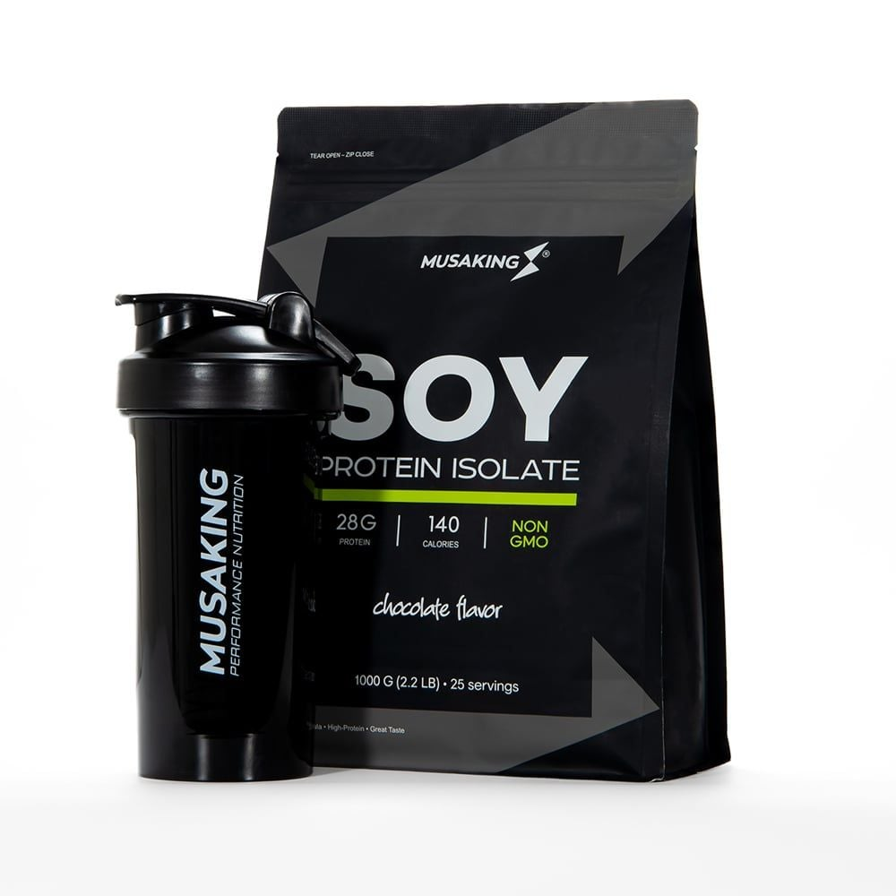
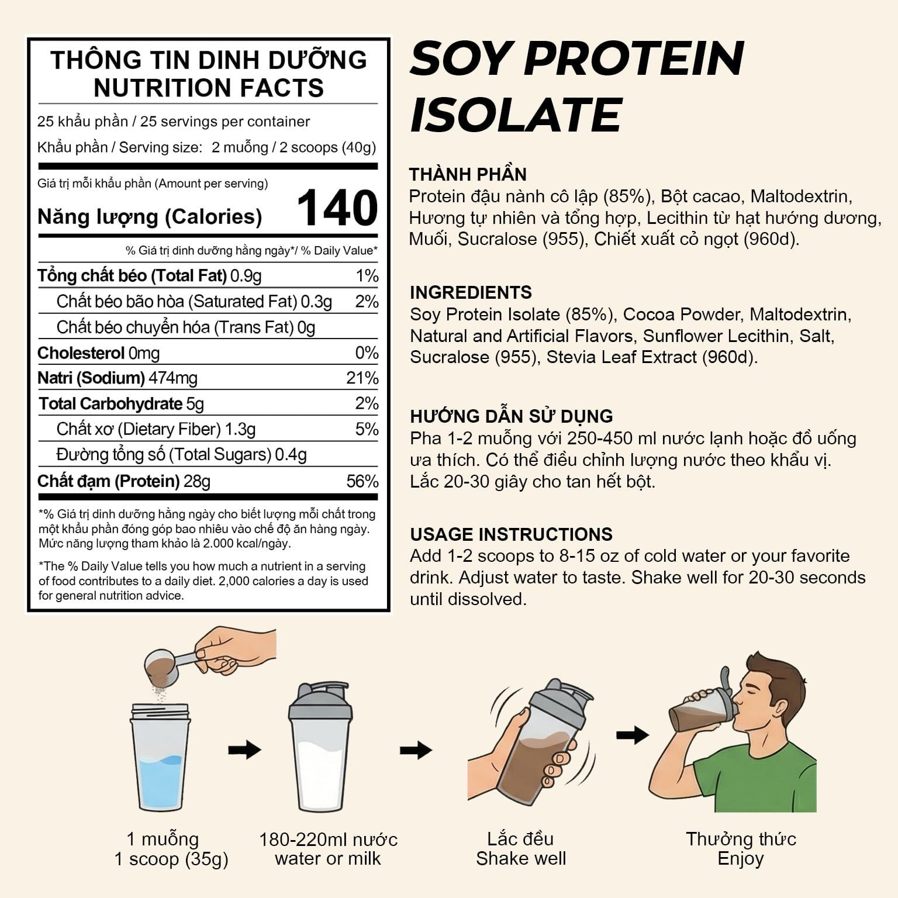
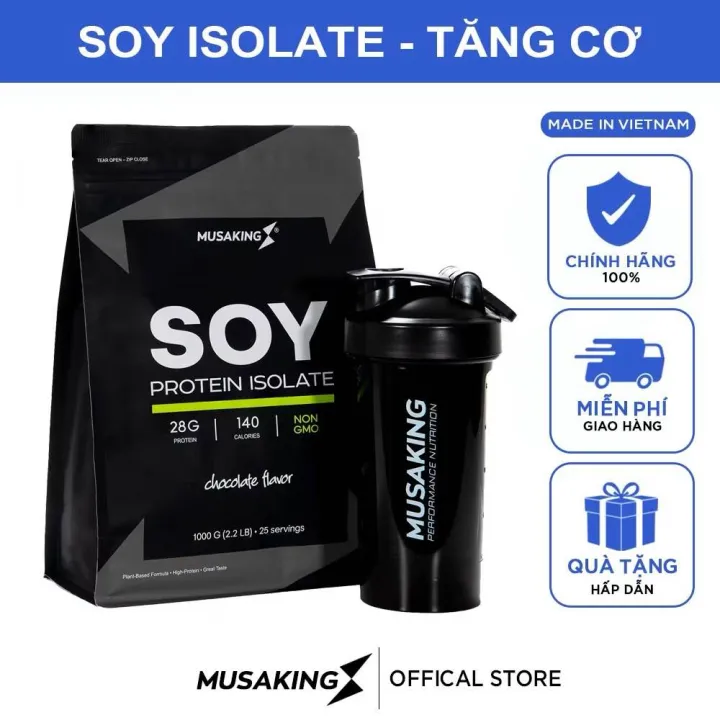
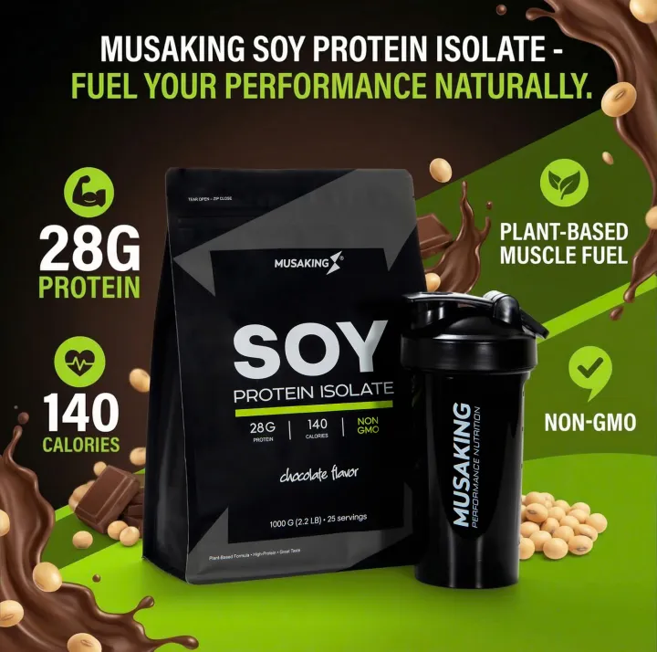

# MusaKing Chocolate Soy Protein Isolate review

The two captured selected Chocolate SKUs show the same single 1 kg bag as the [manufacturer product page](https://musaking.com/products/soy-protein). Their shaker or glove gifts do not add food mass. This is soy isolate; it remains separate from whey in protein-type comparisons.

| Captured listing                                                                      | Selected SKU                   | Food package | Captured price VND | Factory protein in package | VND / protein g before delivery |
| ------------------------------------------------------------------------------------- | ------------------------------ | ------------ | ------------------ | -------------------------- | ------------------------------- |
| [MusaKing Soy 1 kg](https://www.lazada.vn/products/pdp-i3326435113.html)              | 3326435113_VNAMZ-16271820615   | 1 × 1,000 g  | 380,000            | 700 g                      | 542.86                          |
| [MusaKing Soy 1 kg with shaker](https://www.lazada.vn/products/pdp-i13355860469.html) | 13355860469_VNAMZ-116813785174 | 1 × 1,000 g  | 428,000            | 700 g                      | 611.43                          |

The factory nutrition panel declares **28 g protein per 40 g serving** and **25 servings per 1,000 g bag**. Per 100 g, the calculated facts are 70 g protein, 1 g sugars, 2.25 g total fat, 0.75 g saturated fat and 350 kcal. The ingredient list is transcribed from the factory panel in the individual [field reviews](../manufacturer-reviews/). The original image, OCR and marketplace claims remain in the case archive.

The illustration at the bottom of the factory image says “1 scoop (35g)”; it conflicts with the nutrition panel's two scoops / 40 g serving. Calculations use the explicit nutrition-panel serving, corroborated by 1,000 g / 25 servings. This source conflict is retained in both review rationales.

These are historical selected-SKU observations. Current stock and Nha Trang bulk freight require their own captured observations; no bulk winner is established by this review.
