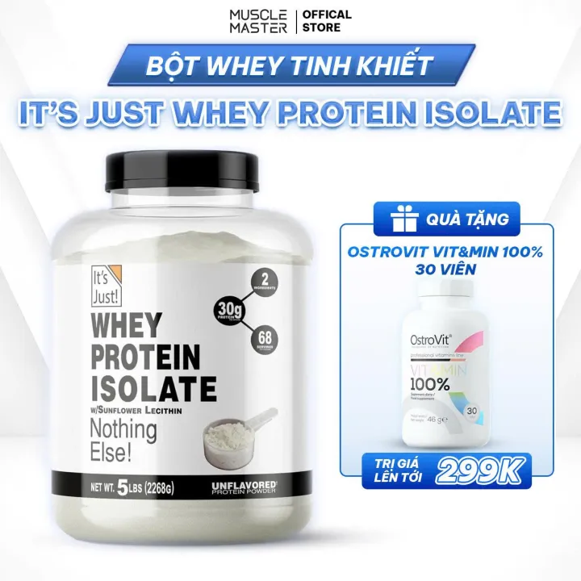
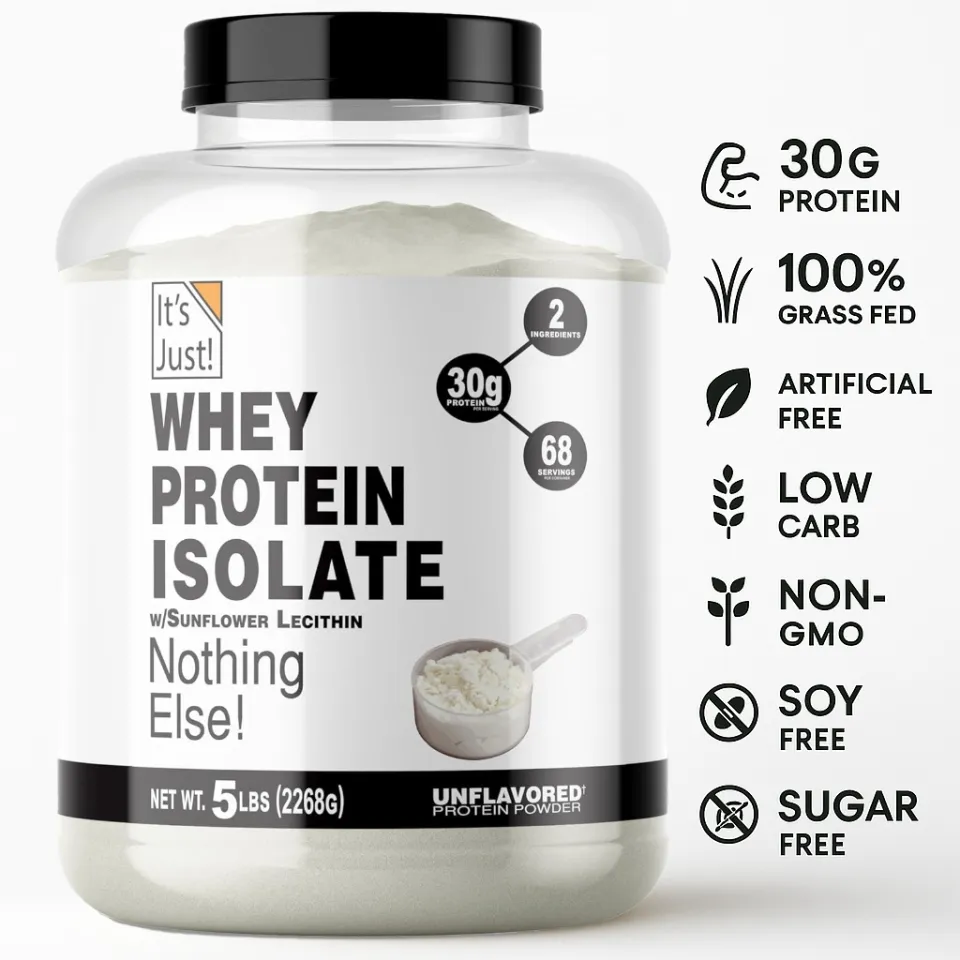

# Urgent whey review for 10.10

The **natural / unflavoured IT'S JUST 5 lb listing i3300919067, SKU 16058119853** matches the manufacturer's published product identity and complete specifications. The selected SKU's fresh 10 October capture at **13:48:51 UTC** confirms **2,952,300 VND** merchandise plus **80,200 VND** delivery to Nha Trang for **one container**, or **3,032,500 VND** total. This is **1,431.89 VND/g protein before delivery** and **1,470.79 VND/g protein after delivery**, below the older verified 3,100,000 VND merchandise offers. Quantity-specific bulk freight and checkout voucher eligibility still require separate confirmation. The captured maximum quantity was three.

[Fresh exact review](its-just-16058119853-live.json) · [Fresh selected price, Nha Trang delivery and calculated metrics](its-just-16058119853-live-result.json) · [Original offline validation](its-just-16058119853-result.json) · [Lazada listing](https://www.lazada.vn/products/pdp-i3300919067.html) · [Manufacturer](https://138foods.com/products/its-just-whey-protein-isolate)

The visible package reads **5 lbs (2268 g)**. This corrects the seller headline's rounded 2.3 kg. The official label declares one 33 g scoop with 30 g protein, 1 g sugars, 1 g fat, 0 g saturated fat and 130 kcal. Ingredients are grass fed whey protein isolate and less than 2% sunflower lecithin. The seller's promotional zero-sugar image conflicts with the official label; the comparison uses the official 1 g declaration. Published identity matching does not prove seller authenticity.

The original official back image is already cached in the repository at `data/cases/vietnam-nha-trang/blobs/4f/4fcaa035874c333b47cb935f1804133f167c75979843a95a0c8c802c1eddadf3.gz`; a readable label view is [already published](../manufacturer-labels/its-just-nutrition.png). Review validation ran offline in an isolated temporary associative store: one cache hit, zero network downloads, and no remaining manufacturer specification problems. Shared account and public stores were not modified during this validation.

Apply the review to a public store with `node scripts/urgent-whey-review.mjs --offline --no-ocr`. The script reattaches the cached official source and regenerates the evidence references before applying the review. During live account collection, apply the JSON through the library after confirming that the selected product identity and SKU still match. Reuse the stored review; a fresh source evidence ID must replace its top-level manufacturer evidence ID and any fact reference to that ID.

## Second exact unflavoured selling option

Listing [i2326481300](https://www.lazada.vn/products/pdp-i2326481300.html) has an AMIX headline, but its selected **SKU 15339529115** is **IT'S JUST WHEY ISOLA**. The original cached SKU image shows the same unflavoured 5 lb / 2268 g IT'S JUST package. Its captured price is **3,024,000 VND**, or **1,466.67 VND/g protein** before shipping, with a captured maximum quantity of five. The separately selected AMIX flavours must not inherit these facts.

[Exact selected-option review](its-just-15339529115.json) · [Offline validation](its-just-15339529115-result.json). The JSON includes a sourced manual brand correction that must be applied before attaching the factory review. `node scripts/urgent-whey-selected-brand-review.mjs --offline --no-ocr` applies both steps to a public store. Validation used a separate temporary store and downloaded nothing.

## Lower advertised prices requiring identity verification

| Captured candidate                                           | Advertised selected price |             Declared mass | Evidence limitation                                                                                                                                                                             |
| ------------------------------------------------------------ | ------------------------: | ------------------------: | ----------------------------------------------------------------------------------------------------------------------------------------------------------------------------------------------- |
| NZMP WPC 80%, i2126595433, SKU 10014178624                   |               498,300 VND |                    1000 g | Seller repack. A generic factory ingredient page cannot establish this repack's exact full nutrition, purity, batch or package identity. No factory-verified protein-cost ranking.              |
| Gold Standard-like chocolate, i13430219487, SKU 117214356196 |               566,555 VND |    907 g printed on image | Cached front omits the Optimum Nutrition/ON logo visible on official packaging, and the listing brand is blank. Exact manufacturer identity is unverified; no authenticity conclusion is drawn. |
| ON ShapeyourBody chocolate, i3154800181, SKU 116802296150    |             2,574,000 VND | Seller's 3000 g share bag | Seller repack and generic chocolate option. A manufacturer's sealed retail package cannot establish this share bag's exact flavour, fill weight and full specification.                         |

Vanilla, strawberry and mango candidates are excluded from this urgent whey scope. Natural/plain/unflavoured and exact chocolate remain eligible. Selling options that switch brands require selected-SKU image and label checks before manufacturer facts are assigned.

## Other brand candidates

The [earlier additional source audit](additional-candidate-gaps.json) retains exact selected SKUs, captured prices, original manufacturer HTML and label hashes, extraction errors and concrete identity requirements. It was generated with `node scripts/urgent-whey-candidate-gaps.mjs`: source digests were checked, no network requests were made and no incomplete factory reviews were applied. Its CGN source gap was subsequently resolved by the exact review below.

| Selected chocolate candidate                                                                                                                                                                                  |          Captured merchandise price | Factory evidence still required                                                                                                                                                                        |
| ------------------------------------------------------------------------------------------------------------------------------------------------------------------------------------------------------------- | ----------------------------------: | ------------------------------------------------------------------------------------------------------------------------------------------------------------------------------------------------------ |
| [ProSupps Chocolate Ice Cream, SKU 6552645102](https://www.lazada.vn/products/pdp-i1553990700.html)                                                                                                           |                       1,150,000 VND | Seller images mix current Premium and older L-carnitine formulas. Confirm the exact supplied package before assigning the current [official label](../manufacturer-labels/prosupps-current-label.png). |
| [California Gold Nutrition Dark Chocolate, SKU 12587822048](https://www.lazada.vn/products/pdp-i2582378529.html)                                                                                              |                       1,600,000 VND | Factory review now complete; current selected price and Nha Trang bulk delivery still require confirmation.                                                                                            |
| [Rule One Chocolate Fudge, SKU 1126718015](https://www.lazada.vn/products/rule-1-protein-5lbs-bo-sung-protein-100-whey-isolate-and-hydrolyzed-hap-thu-cuc-nhanh-tang-co-cuc-manh-i524088580-s1126718015.html) | 3,999,500 VND; captured unavailable | Seller front is 5.01 lb / 2270 g and 71 servings. The current official Chocolate Fudge source has 1.5 lb package references; exact 5 lb package evidence is missing.                                   |

Rule One's [original official label](rule1-chocolate-fudge-original.png) has transparent pixels that obscure black ingredient text in a dark image viewer. The [white-background preview](rule1-chocolate-fudge-white.png) preserves those pixels and makes the complete ingredient list readable. Visual review confirms a 32 g scoop with 25 g protein, 0 g sugars, 0.5 g fat, 0 g saturated fat and 120 kcal; whey isolate and hydrolyzed whey isolate, alkalized cocoa, flavours, sucralose, salt, acesulfame potassium, soy lecithin and sunflower lecithin. These pending formula facts have not been applied to the unresolved 5 lb listing.

## California Gold Nutrition exact dark chocolate review

[SKU 12587822048](https://www.lazada.vn/products/pdp-i2582378529.html) is one **907 g Dark Chocolate Sport Whey Protein Isolate** pouch. The selected seller front matches the official product's brand, flavour, package mass and 27 g protein declaration. [iHerb Corporate](https://corporate.iherb.com/iherb-introduces-california-gold-nutrition-beauty/) identifies CGN as its house brand, and the [brand owner's exact product page](https://mu.iherb.com/pr/california-gold-nutrition-sport-whey-protein-isolate-dark-chocolate-2-lb-907-g/82696) supplies product code **CGN-01202** and UPC **898220012022**. This ownership authority applies only to CGN; other manufacturers sold by iHerb do not inherit it.

The original [official front](cgn-sources/dark-chocolate-907g-front-original.jpg) and [official back](cgn-sources/dark-chocolate-907g-back-original.jpg) confirm a 40 g scoop with **27 g protein, 6 g total sugars, 0.5 g fat, 0 g saturated fat and 150 kcal**. Ingredients are whey protein isolate from milk, organic cane sugar, non-alkalized cocoa, natural flavours, sea salt, xanthan gum, sunflower lecithin and stevia. The seller's claim of no sweeteners is corrected: the package contains cane sugar and stevia, while the official front excludes artificial sweeteners. The older seller label declares 6 g added sugars; the current official label declares 5 g. Both total-sugar declarations are 6 g, and the complete ingredient lists agree. That label revision conflict is retained explicitly.

[Exact review](cgn-dark-chocolate-12587822048.json) · [Applied public-store receipt](cgn-dark-chocolate-12587822048-result.json) · [Primary factual source JSON and provenance](cgn-sources/primary-web-source.json). The historical selected price **1,600,000 VND** divided by **612.225 g protein** is **2,613.42 VND/g protein before delivery**. This exceeds the reviewed IT'S JUST candidates. No current price or Nha Trang bulk-delivery quote is asserted.

The product HTML request returned HTTP 403 once and was not retried. The source JSON identifies factual extraction from the primary web page and does not claim captured product HTML. Four original official image versions and their hashes are retained. Higher-resolution images are linked to the corresponding published thumbnail identifiers and were compared visually. Local OCR plus visual review validated the exact specifications in an isolated store, then applied the same review to the public store with **three cache hits and zero downloads**. `node scripts/urgent-whey-cgn-review.mjs --offline --data-dir /path/to/public-store` replays the checked source imports and review without browser requests.
