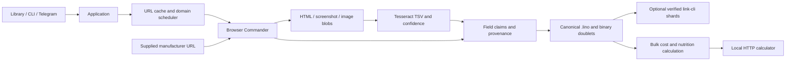

# Product research architecture

Browser Commander navigates the marketplace's UI; the collector reads the rendered DOM and embedded JSON-LD. Static image responses are captured once, cached by URL and content hash, and reused for OCR and later page rendering. The implementation makes no calls to a private Lazada product API.

Products describe the observed SKU; offers describe that SKU's seller, price, currency, stock and delivery quote. Prices expire independently of manufacturer evidence. An unselected variant cannot enter a confirmed-price ranking. Price/quote history uses immutable content-hash identities. The current product record retains older claims and every attached evidence reference.

Raw cache snapshots retain unknown fields, descriptions, variant options, image URLs and page links. Original HTML and images are content-addressed blobs. OCR retains words, bounding boxes, confidence, engine version, languages and segmentation mode. OCR values remain provisional until reviewed or supported by identity-matched manufacturer evidence. Duplicate identical nutrient text is accepted; inconsistent values, simultaneous per-serving/per-100g columns and volume-only nutrition are left for review.

The associative object codec supplies readable source files. The application's binary graph stores named self-links and deduplicated source/target pairs. Semantic links connect offer → product and record → evidence/cache/OCR. A combined graph interns identifiers and values across records. Native mirroring imports numeric doublet addresses through Rust link-cli and exports a binary links-notation archive. A fresh process imports that archive and verifies the complete graph before the shard becomes active. A lossless `atoms.lino` dictionary maps numeric atom addresses to full typed labels, avoiding the native named-import performance problem reported in [link-cli#110](https://github.com/link-foundation/link-cli/issues/110). The content digest includes both graph and dictionary. Rust link-cli 1.0.0's working database persists as text; its separate `--export-binary` archive provides the native binary representation. The application format and native archive remain explicitly distinguished.

The accommodation-search project informed raw-field preservation, explicit official-source provenance, domain scheduling, cached browser snapshots, unavailable-offer handling, allowlisted Telegram commands and restartable collection. The hh automation project informed `.lenv` configuration and Browser Commander use. This repository retains the template's release and static-quality gates.

Current live limits: Lazada can change selectors, hide variants, personalize prices or require authentication. Exact manufacturer URL discovery is operator-driven. The program does not infer density from ice-cream volume or automatically decide whether an ingredient is healthy. Nha Trang shipping and cold-chain eligibility must be supplied as observed quotes. Deterministic tests validate the application; a successful live cohort is required before claiming a real purchase winner.
